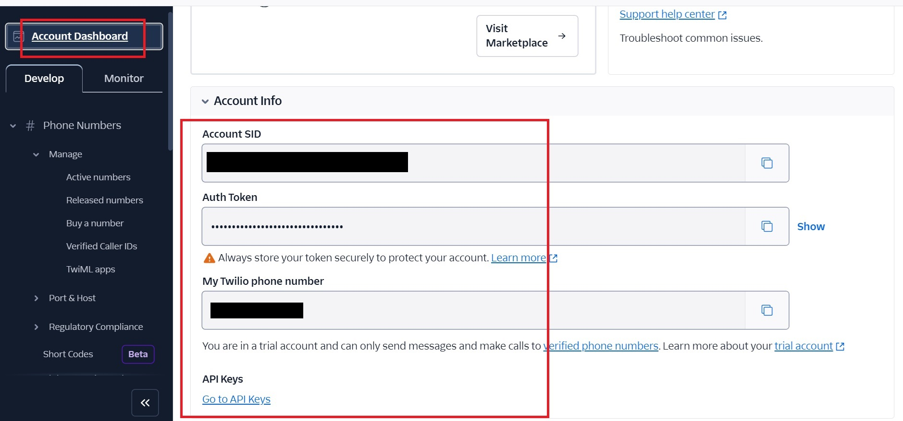
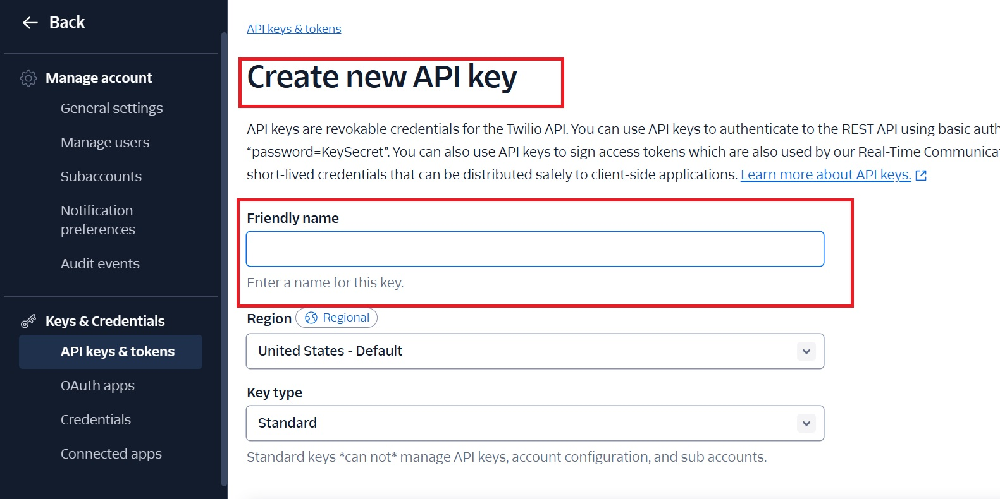
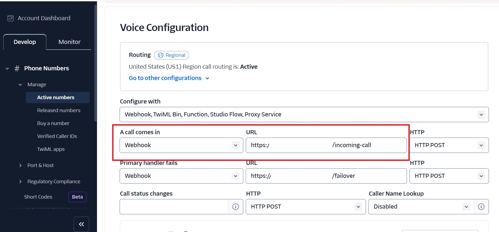
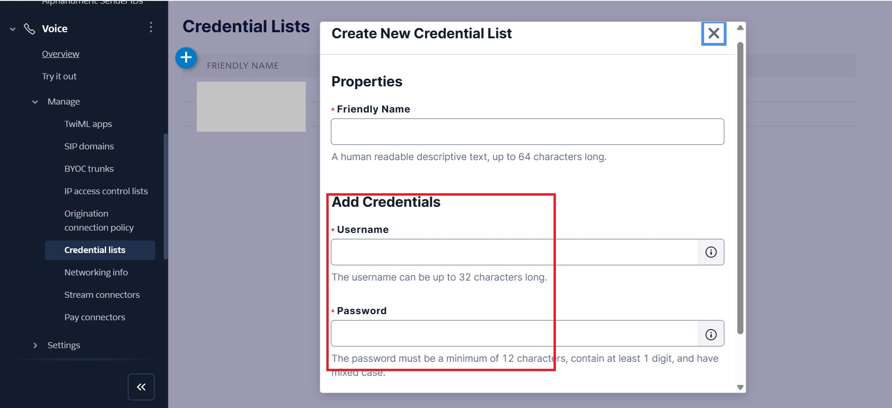
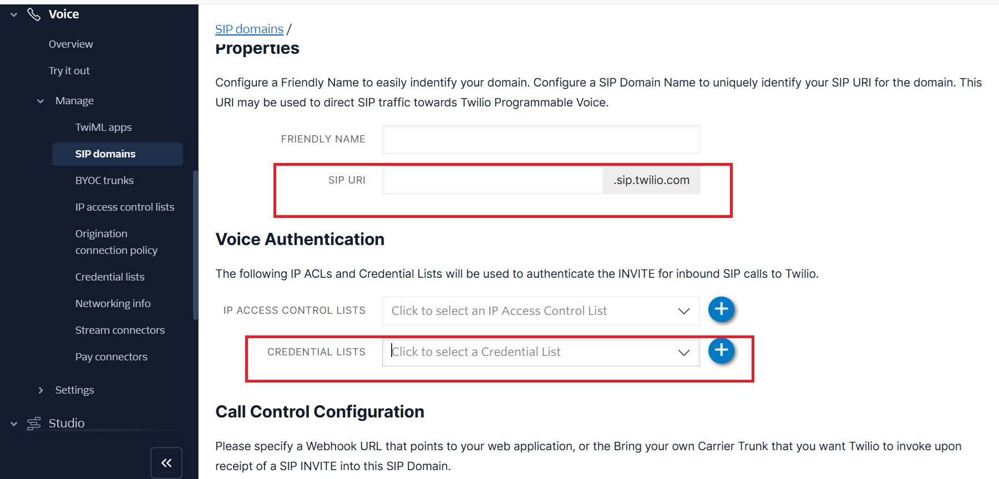
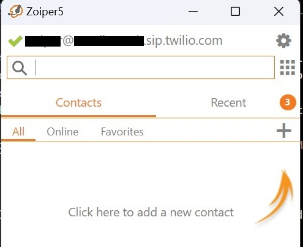
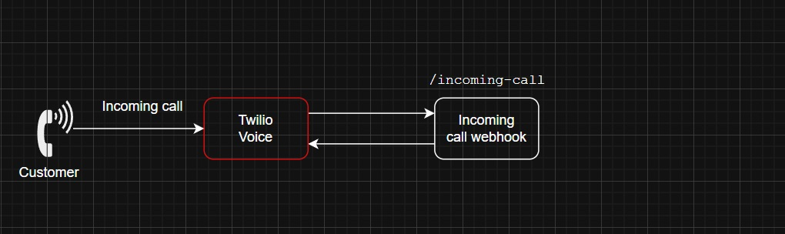
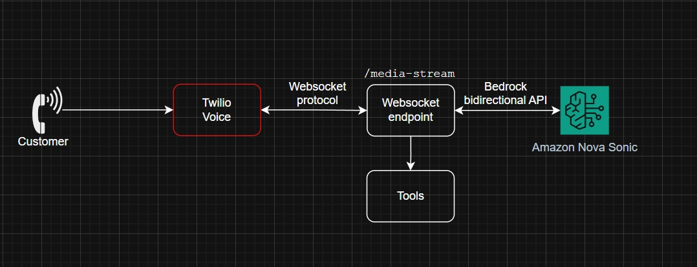
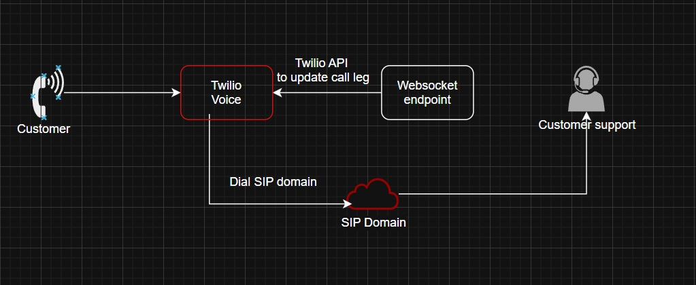

### Prerequisites

#### Local dev
- Install node.js 18+
- Install [localtunnel](https://github.com/localtunnel/localtunnel) to expose local server to the internet `npm i -g localtunnel`
- AWS profile configured with environment variable `AWS_PROFILE` defaulting to `bedrock-test` and region configured via `AWS_REGION` defaulting to `us-east-1`
#### Twilio account
- A Twilio account. Sign up for [free](https://www.twilio.com/try-twilio)
- A Twilio Phone number with voice capabilities. [Instructions here](https://help.twilio.com/articles/223135247-How-to-Search-for-and-Buy-a-Twilio-Phone-Number-from-Console)
- (Optional) A programmable SIP domain to demo escalation to a call center agent. Check [SIP domain section](https://www.twilio.com/en-us/blog/studio-voice-genesys-cloud-account#sip-domain) in this blog

### Configuring Twilio

1. Go to account dashboard and capture the **Account SID** . 
We need this to set `TWILIO_ACCOUNT_SID` environment variable.

2. Click on the Generate API keys and capture the newly created API keys.
We need this to update the `TWILIO_API_SID` and `TWILIO_API_SECRET` environemnt variables.

#### Configure the incoming call webhook 
1. Sign up for Twilio account - voice capabilities and claim a phone number
2. In the active phone, go to the corresponding **Voice Configuration** tab and paste the url path webhook for incoming call. In our case, the uri is `incoming-call`, so the path will be `https://<random_domain>.loca.lt/incoming-call`. We will get this after running our app below.

### Build & Run

- Clone the library and `cd` into it
- Install the dependencies by running `npm install` 
- Build the app by running `npm run build` 
- Run the command `npm start` to start the webserver that interfaces with Amazon Nova Sonic via Bedrock. **Make sure all the environment variables are set before running this command**. 
- In a different terminal, run `lt --port 3000`  to tunnel the app and <u>capture the public endpoint</u>. You could also use ngrok instead.
- Once the endpoint is captured, configure the webhook on the Twilio phone under "A call comes in" field

### Test 
 - Dial the phone number, it will play a welcome message and it connects to the websocket endpoint that connects to Amazon Nova Sonic model
 - All your speech will be handled and responded by Sonic
 - Say something like "I need to cancel my reservation" to invoke the tools 

### (Optionally) Call forwarding to an agent.

1. Create SIP user credentials to be connected to softphone

2. Create a SIP domain to forward the calls to a customer support agent. Make sure the user credentials are attached.

3. Download a softphone like [Zoiper](https://www.zoiper.com/en/voip-softphone/download/current) and login using the SIP user credentials generated above 

4. Set the environment variable `SIP_ENDPOINT` to the SIP user (E.g. \<username\>@\<domain\>.sip.twilio.com) and run `npm start` again

5. While on the call, say something like "I need help with billing issues, connect me to an agent" to route the call to the agent. 

### Call Flow

#### Invoke webhook on a new incoming call
All incoming calls in Twilio are routed to the webhook, which in our case, is `/incoming-call` and TwiML should be returned with our Websocket endpoint (which is `/media-stream` ) for Twilio media streams to connect to.

#### Invoke webhook on new call
Twilio programmable voice API connects to the websocket endpoint and streams the media (the call audio) to it.
The application passes the audio to Nova Sonic speech-to-speech model via Bedrock's bidirectional API. This allows the incoming and outgoing audio to be exchanged asynchronously.
When the Sonic model detects a tool use, the corresponding tool will be invoked and the tool result is passed back to the model.

#### Escalate the call to a customer support agent
When the Sonic model detects "support" tool use, the current call leg is updated to dial a SIP endpoint.
When an agent is connected to the endpoint using a softphone, that phone will ring.

